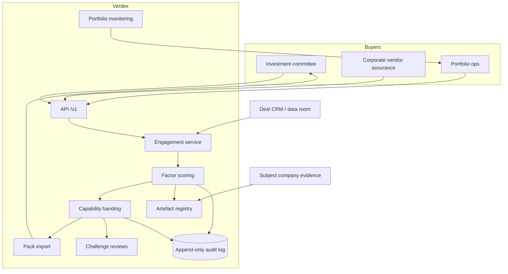

# Verdex

**Source:** `ai-in-gov/APPGAI_Theme Report 4/`
**Domain:** `ai-gov`
**One-liner:** Verdex is an investor- and board-grade diligence workbench that scores whether a company has real AI capability — data advantage, proprietary algorithms, talent retention, path to better-than-human performance — so capital stops confusing snake oil automation with machine learning.
**Wedge:** UK early-stage and growth investors diligencing B2B AI startups in financial services, cyber security, and legal tech — the sectors the APPG AI evidence panel already treats as value-creating — plus corporate strategy teams deciding whether an “AI transformation” vendor is inventing or merely rebranding rules.
**Positioning:** A capability-truth market for AI investment. The APPG AI Theme Report 4 on markets and ai-enabled business models records Mike Lynch’s claim that roughly 90% of companies lack real AI capability, 5% have basic capability, and 5% have advanced capability, and that many investors cannot separate real from fake. Verdex turns that diagnosis into a scored, evidence-backed diligence standard rather than another pitch-deck checklist.

## Market research synthesis

### Thesis from source

The fourth All-Party Parliamentary Group on Artificial Intelligence evidence meeting (10 July 2017, House of Commons) convened 105 participants around how AI restructures markets and business models. The report extracts five trends: new products and services; efficiency gains that reorganise production rather than merely replicate labour; new vertical, horizontal, and hybrid business models; broader access with mass personalisation; and a redefinition of competitive success away from the market offering toward data access, platform control, and AI capability.

The commercially sharpest claim is about capital misallocation under hype. Lynch warned of first-mover advantage when strategic data compounds learning, named the NHS as a data asset that must not be given away only for the public to be charged excessively for the resulting systems, and stated that ostensible AI software is often “snake oil” — simplistic automation that fails on complex real-world situations. MMC Ventures’ analysis of roughly 300 UK software startups found 60% of AI activity founded in the prior 36 months, a B2B skew, uneven entrepreneur focus, and UK sectors still early relative to the US; MMC also described a 17-factor investment framework including power of data network effects, distance from monoliths, proprietary algorithms, and ability to obtain and retain talent. Written evidence in the report further unpacks machine-learning suitability: bounded problems, path to near- or better-than-human performance, and data that retains value after algorithm iteration (fraud history retains value; many chatbot logs do not).

Macro numbers frame the urgency without being the product. Accenture’s cited estimate puts AI’s UK contribution at an additional £630 billion by 2035 (GVA growth from 2.5% to 3.8%); PwC puts UK GDP 10.3% higher in 2030 — about £232 billion. Tech giants’ 2016 AI spend is cited at $20–30 billion, with roughly 90% on R&D and 10% on acquisitions; over 550 AI startups raised about $5 billion that year. Adoption is uneven: high in telecom, automotive, and financial services; medium in retail, media, and CPG; low in education, healthcare, and travel. The action points closing the report call for investors who understand intangible AI businesses and for stakeholders who grasp that platform control and data access — not product catalogues — now decide winners.

From this, the shippable wedge is not “AI market intelligence” but a diligence object: a graded capability score with evidence artefacts that an investment committee can defend when the 90% failure mode arrives.

### Buyer & economic model

- Primary buyer: partner or principal at a UK venture firm, growth equity fund, or corporate venture arm diligencing ai-labelled deals; secondary buyer is the board risk or strategy committee at a regulated incumbent evaluating vendor AI claims.
- Users: investment associates running diligence; technical advisors scoring algorithm and data claims; portfolio value-creation teams monitoring post-investment capability drift; compliance officers where algorithmic trading or identity verification sits under regulation.
- Budget owner / value metric: deal diligence budget and write-off avoidance. Value metric is false-positive “AI company” investments avoided and the share of portfolio companies whose Verdex grade survives an independent technical review.
- Competing status quo: founder pitch decks plus a one-hour technical call; generic cybersecurity questionnaires; consultant slide packs that assert “ML maturity” without testing whether historic data still trains the next model version; and press coverage that treats fundraising as proof of capability.

### Domain constraints

- Regulatory / trust / safety: financial-market algorithmic trading, identity verification, and cyber security sit in regulated domains; diligence outputs may be discoverable in limited-partner reporting; ORBIT-style responsible research framing (Anticipate, Reflect, Engage, Act) from the evidence panel applies when scoring dual-use or socially consequential systems.
- Data sensitivity: diligence evidence often includes proprietary datasets, customer contracts, and unpublished model performance; Verdex must hold attestations and hashes, not raw training corpora, and must support clean-room review with named NDAs.
- Change-management realities: founders will game any single score; grades must be factor-decomposed and time-stamped; investors will not abandon existing IC memos, so Verdex must export a memo-ready evidence pack that sits beside the investment paper rather than replacing the firm’s process.

## Business requirements

- BR-1: Every diligence subject receives a graded capability band — none, basic, or advanced — with a written definition matching the source’s three-way split, and the band cannot be published without factor scores underneath.
- BR-2: Scoring must cover at least data network-effect power, distance from platform monoliths, proprietary algorithm claim strength, talent obtain-and-retain capacity, path to better-than-human or near-human performance, and historic-data retention value after algorithm change.
- BR-3: Any claim labelled “machine learning” that is only deterministic automation must be flagged as non-ML with a stated basis, so snake oil cannot clear as advanced capability.
- BR-4: Sector context must be recorded — high, medium, or low adoption industry as in the evidence — because the same capability grade has different commercial meaning in banking versus education.
- BR-5: Strategic public data dependencies (for example NHS-scale health data) must be declared with a public-interest risk note when the company would commercialise models trained on public assets.
- BR-6: Each factor score requires an evidence artefact type — dataset description, model card, talent census, customer retention proof, or independent benchmark — and scores without artefacts remain provisional.
- BR-7: Grades expire on a fixed clock unless revalidated, because capability drifts when key researchers leave or data licences end.
- BR-8: The system must support a negative path: an investment committee can request a challenge review that reopens a grade when new contrary evidence arrives, with the prior grade retained as history.
- BR-9: Exports must produce an LP- or board-ready diligence pack that separates facts, judgements, and unknowns, matching the action point that investors must understand intangible AI businesses.
- BR-10: Competitive-success factors — AI capability, private data access, platform control — must be reportable separately from product-market offering scores, so the diligence does not collapse back into a feature checklist.
- BR-11: Responsible-innovation checkpoints drawn from Anticipate–Reflect–Engage–Act must be available for subjects in high-consequence domains, without blocking commercial diligence for low-consequence tools.
- BR-12: Pricing and access must allow a diligence firm to white-label the pack under its own brand while preserving an immutable audit trail of who scored what and when.

## User stories

Canonical user stories live in sibling [USER_STORIES.md](USER_STORIES.md).

## System design

### Overview

Verdex takes a company (or a named product line) through a structured diligence engagement. Analysts register the subject, select sector adoption context, and score factors against required evidence artefacts. A rules layer prevents advanced bands without artefacts, flags non-ML automation, and expires stale grades. Challenge reviews reopen scores when contrary evidence arrives. Outputs are memo-ready packs for investment committees and board vendor assurance, plus portfolio monitoring hooks for talent and data-licence drift.

### Actors & boundaries

- Actors: investment partners and associates; technical advisors; corporate vendor-assurance officers; portfolio operators; platform administrators; the subject company supplying evidence under NDA.
- Trust boundary: Verdex holds scores, attestations, and artefact metadata — not training corpora or customer PII. Subject systems remain outside; evidence is uploaded as redacted packs or reviewed in a clean room.
- Human-in-the-loop points: factor scoring judgements; non-ML determination; challenge adjudication; grade publication approval; clean-room access grants.

### Core capabilities

1. **Subject and engagement onboarding** — company/product registration, sector context, NDA and clean-room setup.
2. **Factor scoring framework** — versioned factor definitions including MMC-style success factors and ML suitability tests.
3. **Evidence artefact registry** — typed artefacts bound to factors with provisional vs final status.
4. **Capability banding** — none / basic / advanced with publication gates.
5. **Snake-oil detection rules** — non-ML automation flags and refusal paths.
6. **Strategic data risk notes** — public-asset dependency declarations.
7. **Grade lifecycle** — expiry, revalidation, challenge reviews with history.
8. **Diligence pack export** — IC/board packs separating facts, judgements, unknowns.
9. **Portfolio monitoring** — talent and data-licence drift signals post-investment.
10. **Governance and audit** — immutable score change log and access control.

### Conceptual data

- Primary entities: SubjectCompany, ProductLine, DiligenceEngagement, SectorContext, FactorDefinition, FactorScore, EvidenceArtefact, CapabilityGrade, NonMlFlag, StrategicDataRiskNote, ChallengeReview, DiligencePack, PortfolioMonitorSignal, AccessGrant, AuditEvent.
- Critical events: engagement opened; factor scored; artefact attached; non-ML flagged; grade published; grade expired; challenge opened/resolved; pack exported; monitor signal raised.
- Retention / audit needs: grades and challenge history retained for the life of the fund plus LP audit window; artefact binaries under NDA retention with deletion on engagement close where contracted; audit events append-only.

### Integrations (conceptual)

- Systems of record: CRM/deal pipeline tools; data rooms; HRIS snapshots for talent census (aggregate only); model registries and experiment trackers at the subject company.
- Upstream signals: funding databases for cohort context; sector adoption benchmarks; regulatory classification hints for algorithmic trading and identity verification.
- Downstream actions: IC memo attachment; LP reporting excerpts; portfolio intervention tickets; vendor onboarding gates in procurement.

### High-level architecture

### Success metrics

- Leading: share of diligences with all mandatory artefacts before publication; median days from engagement open to published grade; challenge rate within 90 days; share of subjects flagged non-ML.
- Lagging: share of published advanced grades that survive independent technical review; portfolio write-downs correlated with pre-investment Verdex band; LP satisfaction with diligence pack completeness; reduction in “ai-washed” deals reaching IC without a non-ML flag when warranted.

## OpenAPI skeleton

Canonical HTTP surface lives in sibling [openapi.yaml](openapi.yaml). Summary:

- **Base path:** `/v1/...`
- **Auth:** `X-API-Key` for portfolio monitors and CRM connectors; Bearer JWT for analysts and IC operators.
- **Resource groups:** Engagements, Factors, Evidence, Grades, Challenges, Packs, Monitoring.
