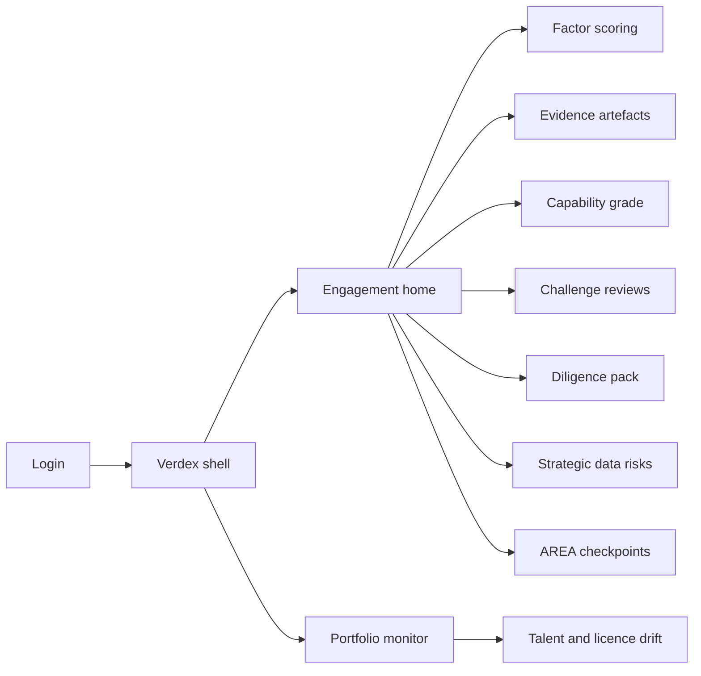
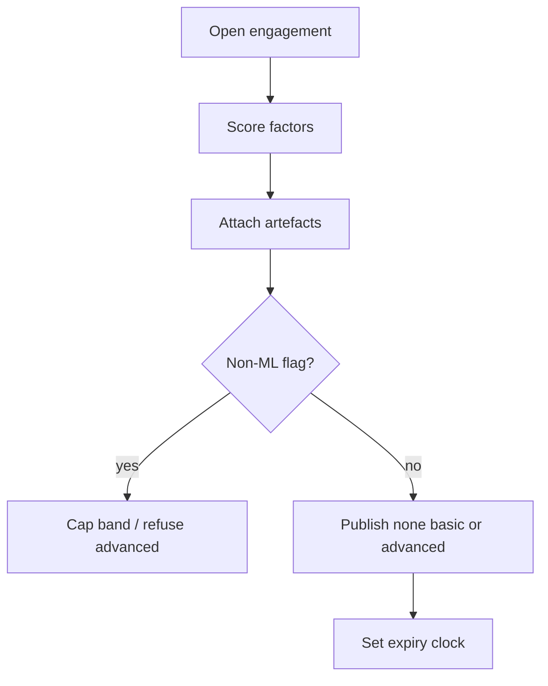

# Verdex — Web app

**Product:** [PRODUCT.md](./PRODUCT.md)
**Primary surface:** Investor and board diligence workbench (capability grading)
**Secondary surfaces:** Clean-room evidence review; portfolio capability-drift monitor; white-label IC pack export
**Design thesis:** Verdex is a capability-truth bench for capital — built to catch the APPG-era failure mode where ~90% of “AI companies” are snake oil automation. The UI metaphor is a factorised assay lab: every band (none / basic / advanced) must show underlying factor scores and typed evidence artefacts, or publication is refused; deterministic rules engines get a hard non-ML flag that marketing language cannot override. Visual language is assay-bench graphite with assay-green for artefact-backed scores and caution copper for provisional or expired grades — money decisions feel forensic, not pitch-deck glossy. The Verdex wordmark sits as a quiet assay mark on every published grade and IC pack.

## UX research synthesis

### Category peers (best-in-class)

- **PitchBook / Affinity diligence workflows:** Deal-centric evidence beside the IC memo. Steal: memo-ready export that sits beside existing IC process; reject replacing the firm’s investment paper wholesale.
- **MMC Ventures–style factor frameworks (as described in APPG evidence):** Multi-factor AI investing lenses (data network effects, talent, distance from monoliths). Steal: decomposed factors over a single hype score; reject fundraising press as proof of capability.
- **Model cards / datasheets for datasets (Mitchell et al. patterns in enterprise ML governance tools):** Typed artefacts for model and data claims. Steal: artefact-gated scoring; reject advanced bands without evidence.
- **ORBIT / responsible research Anticipate–Reflect–Engage–Act checklists:** Optional high-consequence checkpoints. Steal: dual-use reflection without blocking low-consequence tools; reject ethics theatre as the only diligence.

### Patterns to adopt / reject

- **Adopt:** Three-way capability bands with mandatory factor decomposition; non-ML automation flag; historic-data retention value test; sector adoption context; public-data dependency risk notes; grade expiry/revalidation; challenge reviews with history; facts/judgements/unknowns pack structure; portfolio talent and licence drift monitors; immutable score audit; white-label pack with audit trail preserved.
- **Reject:** Single “AI maturity %”; pitch-deck screenshots as sole evidence; editable grade history; purple “AI deal scout” chat as primary scorer; collapsing diligence into feature checklists.

### Trust, density, and workflow constraints from PRODUCT.md

Hold attestations and hashes, not training corpora (clean-room + NDA). Founders will game single scores — factors must be visible and time-stamped (BR-1, BR-6). Grades expire (BR-7). Challenge path preserves prior grade (BR-8). LP/board packs must separate unknowns (BR-9). Competitive-success factors stay separate from product-market scores (BR-10).

## Information architecture

### Nav model

### Roles → default home

| Role | Default home | Why |
|------|--------------|-----|
| Investment partner / IC | Engagement home — grade + unknowns | Decide before term sheet (BR-1, BR-9) |
| Associate / analyst | Factor scoring | Artefact-backed factors (BR-2, BR-6) |
| Technical diligence advisor | Evidence + non-ML flags | Snake-oil detection (BR-3) |
| Corporate vendor assurance | Vendor comparison engagements | Data advantage vs monoliths (BR-10) |
| Portfolio value-creation | Portfolio monitor | Drift before next narrative (BR-7) |
| Compliance / admin | Audit log + clean-room grants | Immutable who-scored-what (BR-12) |

### Cross-links to OpenAPI resources

| Nav area | OpenAPI tags / resources |
|----------|---------------------------|
| Company / engagement onboarding | Engagements |
| Factor definitions and scores | Factors |
| Artefact registry | Evidence |
| None / basic / advanced bands | Grades |
| Reopen on contrary evidence | Challenges |
| IC / board exports | Packs |
| Post-investment signals | Monitoring |

## Screen inventory

### Engagement home

- **Purpose:** One diligence subject with sector context, grade state, and open unknowns.
- **Entry:** From deal CRM; post-login.
- **Layout regions:** Brand + firm switcher; subject header; band (or provisional); factor completeness meter; unknowns list; expiry countdown; clean-room status.
- **Primary actions:** Open factors; publish grade; export pack; open challenge.
- **Empty / loading / error:** New engagement = guided factor checklist; expired grade = copper banner.
- **BR / story ties:** BR-1, BR-4, BR-7.

### Factor scoring bench

- **Purpose:** Score data network effects, monolith distance, proprietary algorithms, talent, path-to-performance, historic-data retention value, etc.
- **Entry:** Engagement → Factors.
- **Layout regions:** Factor list with scores; evidence slot per factor; provisional vs final; competitive-success factors separated from product-market block.
- **Primary actions:** Score factor; attach artefact; mark unknown explicitly.
- **Empty / loading / error:** Score without artefact stays provisional; cannot publish advanced on provisionals (BR-6).
- **BR / story ties:** BR-2, BR-6, BR-10.

### Evidence artefact registry

- **Purpose:** Typed artefacts (dataset description, model card, talent census, retention proof, independent benchmark).
- **Entry:** Factors; clean-room.
- **Layout regions:** Artefact table; hash/attestation metadata; NDA scope; no raw corpus upload by default.
- **Primary actions:** Upload redacted pack; request clean-room review; bind to factor.
- **Empty / loading / error:** Missing type = reject upload.
- **BR / story ties:** BR-6; admin clean-room story.

### Non-ML / snake-oil flag

- **Purpose:** Mark claimed ML that is deterministic automation with cited basis.
- **Entry:** Technical advisor on factor or grade attempt.
- **Layout regions:** Flag panel; basis citation; impact on band eligibility.
- **Primary actions:** Raise flag; clear with new evidence; lock marketing override.
- **Empty / loading / error:** Advanced band attempt while flagged = refused.
- **BR / story ties:** BR-3.

### Capability grade publication

- **Purpose:** Publish none / basic / advanced only with factor decomposition visible.
- **Entry:** When factors complete.
- **Layout regions:** Band selector constrained by rules; factor summary; sector adoption context; publication approval; audit preview.
- **Primary actions:** Publish; schedule expiry; white-label cover.
- **Empty / loading / error:** Publish without factors = blocked (BR-1).
- **BR / story ties:** BR-1, BR-4, BR-12.

### Strategic public-data risk note

- **Purpose:** Declare NHS-scale or similar public asset dependencies with public-interest risk.
- **Entry:** Engagement risks.
- **Layout regions:** Dependency declaration; risk note; IC visibility toggle.
- **Primary actions:** Add note; require IC acknowledgement.
- **Empty / loading / error:** Commercialising public-trained models without note = amber gate.
- **BR / story ties:** BR-5.

### Challenge review

- **Purpose:** Reopen grade on contrary evidence; retain prior grade as history.
- **Entry:** IC request; production incident; portfolio signal.
- **Layout regions:** Challenge case; prior vs proposed; evidence delta; resolution log.
- **Primary actions:** Open challenge; adjudicate; publish revised grade.
- **Empty / loading / error:** Empty = no open challenges.
- **BR / story ties:** BR-8.

### Diligence pack export

- **Purpose:** LP/board-ready pack separating facts, judgements, and unknowns.
- **Entry:** Pack nav; IC meeting.
- **Layout regions:** Three-section preview; white-label cover; immutable audit appendix.
- **Primary actions:** Export PDF/JSON; attach to CRM; share under NDA.
- **Empty / loading / error:** Unknowns section cannot be omitted.
- **BR / story ties:** BR-9, BR-12.

### AREA responsible-innovation checkpoints

- **Purpose:** Anticipate–Reflect–Engage–Act for high-consequence domains without blocking low-consequence tools.
- **Entry:** Optional when sector/consequence high.
- **Layout regions:** Four prompts; applicability toggle; link to grade notes.
- **Primary actions:** Complete checkpoints; waive for low-consequence with rationale.
- **Empty / loading / error:** High-consequence without AREA = amber, not hard block unless firm policy says so.
- **BR / story ties:** BR-11.

### Portfolio drift monitor

- **Purpose:** Watch talent census and data-licence status post-investment.
- **Entry:** Portfolio role default.
- **Layout regions:** Signal list; grade expiry calendar; intervention tickets.
- **Primary actions:** Open revalidation; raise challenge; notify partner.
- **Empty / loading / error:** Healthy = “no drift signals.”
- **BR / story ties:** BR-7; value-creation stories.

## Key flows

1. **Publish capability grade** — open engagement → score factors with artefacts → non-ML check → sector context → publish band; failure: advanced without artefacts refused (BR-1, BR-6).

2. **Snake-oil catch** — claimed ML → technical review → non-ML flag with basis → pack shows flag to IC (BR-3).

3. **Challenge after incident** — contrary evidence → reopen → history retained → revised grade (BR-8).

4. **Follow-on revalidation** — grade expired → re-score talent/data → republish or downgrade (BR-7).

5. **White-label IC pack** — firm cover → facts/judgements/unknowns → audit trail intact (BR-9, BR-12).

## Design system

### Tokens (CSS variables)

- `--color-ink: #E8ECF0` — text on dark bench
- `--color-graphite-950: #101418` — app ground
- `--color-graphite-900: #1A2128` — panels
- `--color-graphite-700: #3A4550` — rules
- `--color-assay: #3CB371` — artefact-backed final score
- `--color-copper: #C47A3A` — provisional / expired
- `--color-coral: #E85D4C` — non-ML block / refused publish
- `--color-steel: #8B98A8` — secondary labels
- `--color-brand: #A8B5C4` — Verdex wordmark
- `--font-display: "IBM Plex Sans", sans-serif` — grade numerals and titles
- `--font-body: "IBM Plex Sans", sans-serif`
- `--font-mono: "IBM Plex Mono", monospace` — hashes, engagement ids
- `--space-1`…`--space-8`: 4px scale
- `--radius-sm: 4px`; `--radius-md: 8px`
- `--motion-assay: 180ms ease-out` — score confirm
- `--motion-expiry: 260ms ease-in-out` — copper pulse
- `--motion-flag: 200ms linear` — non-ML reveal
- Atmosphere: fine grid like an optical bench; no fintech purple; no rocket-ship startup illustration language.

### Typography & brand

- Display for band labels (NONE / BASIC / ADVANCED); mono for hashes and artefact ids.
- Brand on published grade and pack cover; white-label may dominate cover but audit appendix retains Verdex trail mark.
- Login: brand hero; headline (“Score the capability. Not the pitch.”); one CTA.

### Do / don’t

- **Do:** Factor decomposition always visible; refuse artefact-free advanced; flag non-ML; list unknowns; expire grades.
- **Don’t:** Single hype score; purple AI glow; editable history; raw training data in the store; feature-checklist collapse.

### Accessibility & domain trust cues

- AA+ contrast; band never colour-only (text labels).
- Live regions for expiry and challenge openings.
- Focus order: engagement → factors → evidence → grade → pack.
- Clean-room sessions announce recording/attestation status.

## Component patterns

- **CapabilityBandSeal** — none / basic / advanced with publish rules.
- **FactorScoreRow** — score + artefact slot + provisional state.
- **NonMlFlagBanner** — snake-oil determination with basis.
- **UnknownsList** — explicit IC-visible gaps.
- **GradeExpiryClock** — revalidation countdown.
- **ChallengeHistoryRail** — prior grades retained.
- **DiligencePackSections** — facts / judgements / unknowns.
- **StrategicDataRiskNote** — public-asset dependency.
- **PortfolioDriftSignal** — talent / licence alerts.
- **AuditWhoScored** — immutable scorer identity.

## Out of scope for v1 web

- Running subject-company model training; full data-room replacement; consumer crowdfunding UI; automated term-sheet negotiation; public leaderboard of scored startups (confidential by default).
